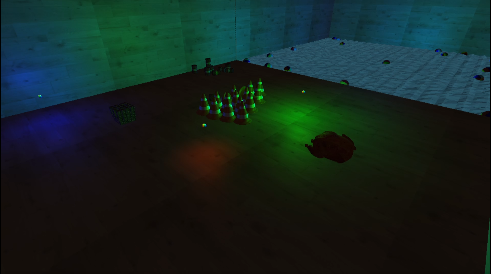

# GamesProgramming

Simple game engine made for Games Programming 3 Module.  

Includes support for multiple lights, user input, physics, and geometry shaders, demonstrated with a low-poly water shader.

## Screenshots

